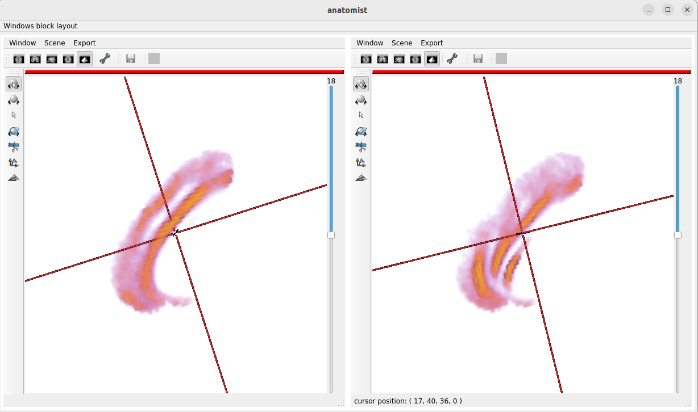

To perform a local averages on the masked sulcal skeleton
---------------------------

For instance, to compute the average of the sulcal shape given a phenotype, you need the BrainVISA environment.
In this example, we work with the number of allele C as the phenotype.
The region is the anterior cingulate cortex (CINGULATE.).
The hemisphere is the left (L).
The subjects ID are in the IID column (IID).
The phenotype is in the column projection.
The 200-subjects averages will be plot on 2 columns, 1 row.

.. code-block:: shell

   bv bash
   cd notebooks
   python3 local_averages.py -p rs_example.csv \
                             -r CINGULATE. \
                             -i L \
                             -s IID \
                             -e projection \
                             -n 2 \
                             -l 1 \
                             -t 200 

with the rs_example.csv such as

.. code-block:: shell

   IID,projection 
   2948423,-0.15536039923644362
   3401792,-0.1347227381567912
   4741853,-0.13361727207750745
   3816649,-0.13024577289203867
   1908139,-0.12334186090363967
   3211681,-0.12114839219002949

Ths program outputs  averages as an Anaotmist window:

