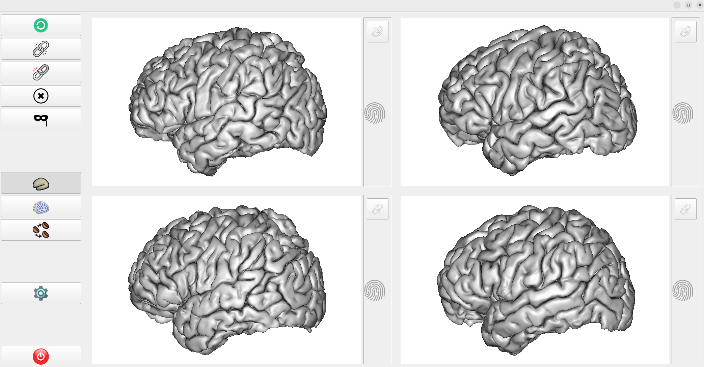

# Twin game

To win the game, you have to choose the correct pairs of twins, based on the morphology of the folds. It permits to get an intuition on what is dependent on genetics and what is dependent on neurodevelopment. Here is the screenshot of the game:



## Get started

First, you need to have installed pyanatomist and pyaims (see the [../README.md](../README.md) at the root of brainvisa_recipes).

The following will work if the HCP dataset is in the directory /neurospin/dico/data/bv_databases/human/not_labeled/hcp, which is the case if you are running the software from the neurospin computer:

If you have installed brainvisa using the ApptTainer way, you can run the program in two ways:
* Either:
```
bv python twingame.py -c twin_config_hcp.json
```
* Or:
```
bv bash
python twingame.py -c twin_config_hcp.json
```

Otherwise, if you have installed pyanatomist and pyaims with pixi:
```
pixi shell
python twingame.py -c twin_config_hcp.json
```

